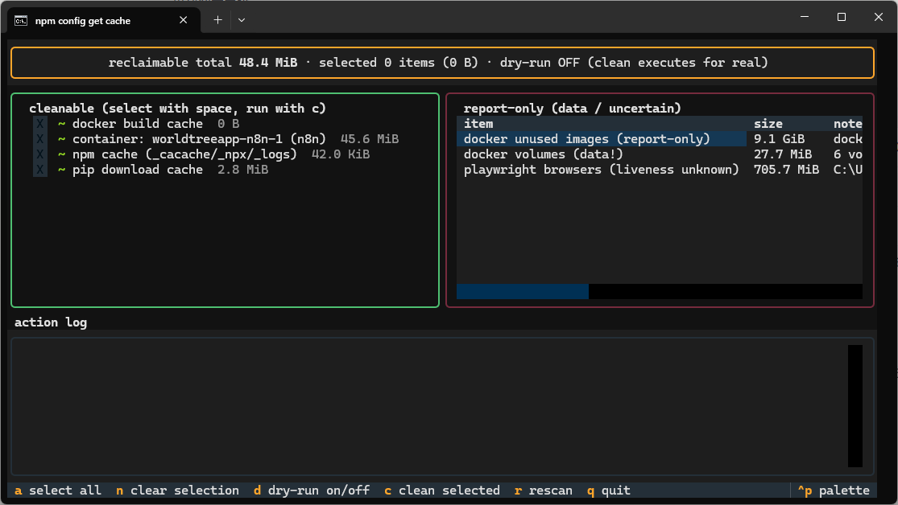
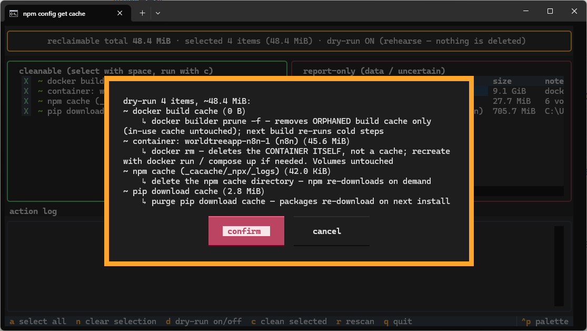

# CacheKat 🐈

[English](README.md) | [中文](README.zh-CN.md)

> A TUI to see which dev caches eat your disk — and reclaim space safely,
> risk-graded. **Never touches your data.**

**Main view** — cleanable items on the left (select with space, run with `c`);
report-only facts on the right (docker volumes, unknown liveness) are visible
but untouchable — the layout itself teaches the safety model:



**Confirm gate** — nothing cleans without an explicit yes; each item carries
its size and a plain-words consequence, and dry-run (`d`) describes what
would happen without touching the disk:



[](https://github.com/Aeluris/CacheKat/actions/workflows/ci.yml)
[](https://www.python.org)
[](LICENSE)

## Why

Every developer machine accumulates caches that nobody watches: pip wheels,
npm tarballs, playwright browsers (old versions pile up per release), docker
build cache, dangling images, stopped containers... A fresh scan answers the
only question that matters: **who is eating the disk, and what is actually
safe to reclaim?**

## Safety model (the feature)

| Category | Behavior |
|---|---|
| True caches (pip, npm, playwright orphans, docker build cache) | Selectable — each row states its plain-words consequence before anything runs |
| **Docker volumes (your data)** | **Report-only. Never cleaned. No flag unlocks this.** |
| Docker stopped containers / unused images | Containers: cleanable **one by one**, each warning that `docker rm` deletes the container **itself** (recreate via `docker run`/`compose up`; volumes untouched). Images: report-only until per-image selection ships. |
| Anything the probe cannot judge | Honest report-only ("liveness unknown"), never a guess |

- Every scan is read-only; cleaning is an explicit, confirmed selection.
- Dry-run mode (`d`): rehearse exactly what would happen — disk untouched.
- Probes that fail surface as visible error rows, never swallowed.

## Install

```
pipx install cachekat
```

Or from source: `pipx install git+https://github.com/Aeluris/CacheKat.git`

## Use

```
cachekat tui             # interactive: scan -> select -> confirm -> clean
cachekat scan            # read-only report: who eats the disk
cachekat scan --json     # machine-readable
# every command accepts --lang auto|en|zh (auto follows the system language)
```

Docker rows need the docker daemon running — if the TUI shows
`docker daemon unreachable`, start Docker Desktop and press `r` to rescan.

## Roadmap

- [x] M0 — skeleton, registry, `scan` CLI, pip probe, CI (win+linux)
- [x] M1 — docker / npm / playwright probes (orphan detection, volumes red-lined)
- [x] M2 — textual TUI: select, confirm, clean, dry-run
- [x] Per-container selection with loud not-a-cache warnings
- [x] i18n: full en/zh, `--lang auto|en|zh`
- [ ] per-image selection, more cache families (cargo, gradle, ...)

See [CHANGELOG.md](CHANGELOG.md) for details, [CONTRIBUTING.md](CONTRIBUTING.md)
to help, [AGENTS.md](AGENTS.md) for the engineering rulebook.

## License

[MIT](LICENSE) — © 2026 Aeluris
